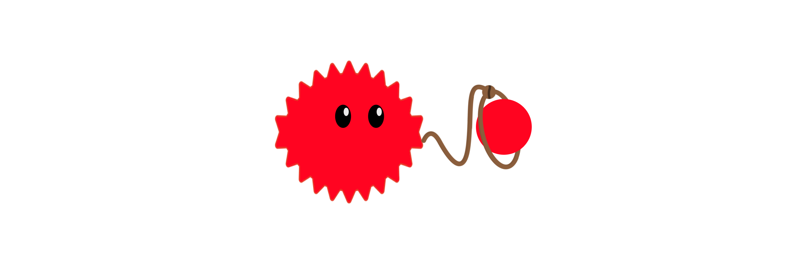

<h1 align="center">
    
</h1>

<h4 align="center">
    A suite of `std` components for OP Stack L2 chain derivation, batch submission, and periphery services.
</h4>

  
  
  
  
  <!--  -->
  <!--  -->

  <a href="#overview">Overview</a> •
  <a href="#security">Security</a> •
  <a href="#contributing">Contributing</a> •
  <a href="#license">License</a>

## Overview

_**r**ust-**op**timism-**e**thereum_

`rope` is a suite of `std` OP Stack components built to be modular.

[bin/](./bin/) provides a host of binary applications that compose rope's [crates](./crates/).

## Security

Specifications around security are provided in [Security.md](./Security.md).

## Contributing

Contributing guidelines are outlined in [Contributing.md](./Contributing.md).

## License

Licensed under either of <a href="LICENSE-APACHE">Apache License, Version
2.0</a> or <a href="LICENSE-MIT">MIT license</a> at your option.

 

Unless you explicitly state otherwise, any contribution intentionally submitted
for inclusion in these crates by you, as defined in the Apache-2.0 license,
shall be dual licensed as above, without any additional terms or conditions.

[mit-url]: LICENSE-MIT
[apache-url]: LICENSE-APACHE
